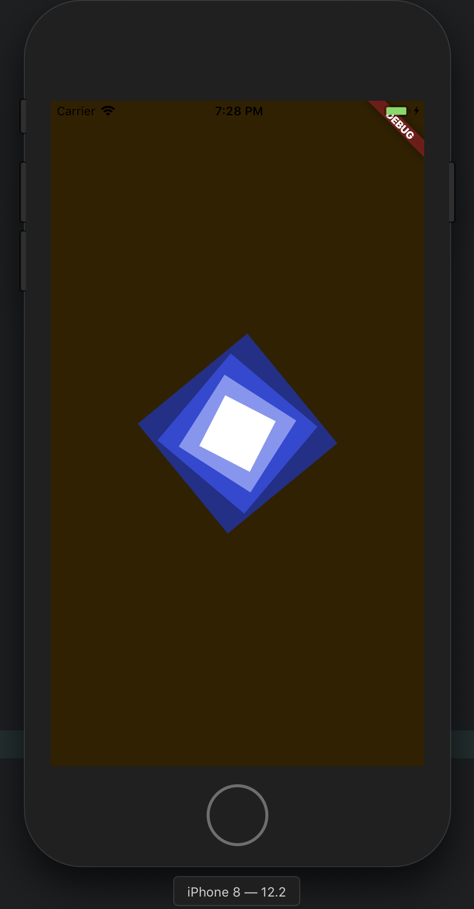

# tilt_card

This repository contains the code for the Flare Flutter workshop held at Google NYC on July 17, 2019.

## About the Workshop
The purpose of the workshop is to show how to build animated graphics for your Flutter app directly in Flare. We'll be showing you how you can quickly go from concept to final assets without stalling development. The workshop won't be convering all the nitty gritty of the code here, but feel free to reach out to us at info@2dimensions.com or open an issue on this repository. 

### Prototype
The code and prototype Flare file used in the master branch was created by a developer ([Luigi](https://twitter.com/luigirosso)) to let 2D designers ([Guido](https://twitter.com/guidorosso) and [Juan Carlos](https://twitter.com/HelloJcToon)) get a sense of how the code was going to manipulate the Flare file at runtime. They took the concept and ran with it and this workshop will follow their process for building the final asset in Flare.

## Getting Started

Clone the master branch.
```
git clone https://github.com/2d-inc/tilt_card
cd tilt_card
```

Make sure dependencies are up to date.
```
flutter pub get
```

Make sure you are on Flutter stable.
```
flutter channel stable
flutter upgrade
```

Test deploy to your device.
```
flutter run
```

You should now see something like this:



## Workshop
Follow along with the workshop to see how to end up here:


You can also check out the [final](https://github.com/2d-inc/tilt_card/tree/final) branch if you just can't wait :)


